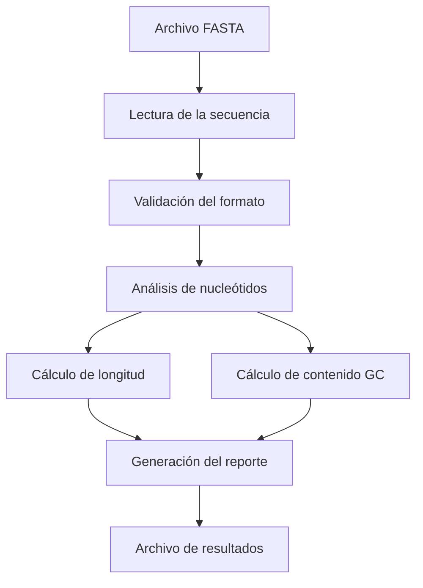

# Proyecto-bioinformatica
Analizador de secuencias FASTA para detectar la mutación en el gen HBB que provoca la Anemia Falciforme.
La anemia falciforme es un trastorno sanguíneo hereditario caracterizado por dolor intenso, anemia crónica y daño a los órganos.
Es causada por una mutación puntual en el gen HBB (beta-globina) en el codón 6, donde una sola base cambia de A -> T
Este proyecto se basa en un script que:
1. Lee un archivo FASTA guardado en el equipo.
2. Busca si la secuencia contiene o no la mutación.
3. Imprime un mensaje según el resultado de la búsqueda.

### Como ingresar la secuencia
Una vez se tenga descargada la secuencia a analizar en formato FASTA, se corre el script analizador_secuencias.py y se coloca la ruta del archivo.
* Ejemplo: C:\Users\hagb\HBB_samples\sample_1.fasta 
 

## 🧬 Flujo de trabajo

## Créditos
Parte del código de este proyecto fue generado con asistencia de Claude AI (Anthropic)
y revisado, validado y adaptado por Hector Armando Garza Balderas.
